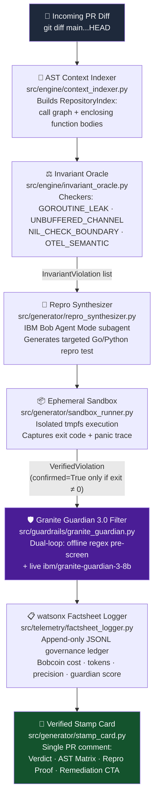

# 🔏 StampBob

### Autonomous Closed-Loop PR Review Engine with Deterministic Invariant Proofs

> *"Don't spam pull requests with AI opinions. Stamp them with deterministic proof."*

---

[](.github/workflows/bob-eval-gate.yml)
[-38bdf8?style=for-the-badge)]()
[-22c55e?style=for-the-badge)]()
[]()
[]()
[]()
[](LICENSE)

---

## Table of Contents

1. [Origin Story & Problem Statement](#1-origin-story--problem-statement)
2. [The 90-Second Rule — Quickstart](#2-the-90-second-rule--quickstart-judge-experience)
3. [Make Automation Targets](#3-make-automation-targets)
4. [Architecture & Closed-Loop Workflow](#4-architecture--closed-loop-workflow)
5. [The Verified Stamp Card](#5-the-verified-stamp-card)
6. [Offline Evaluation Benchmark Results](#6-offline-evaluation-benchmark-results)
7. [How IBM Bob 2.0 Was Used](#7-how-ibm-bob-20-was-used)
8. [Enterprise Safety & Governance](#8-enterprise-safety--governance)
9. [Repository Directory Scaffolding](#9-repository-directory-scaffolding)
10. [Team Baratang & License](#10-team-baratang--license)

---

## 1. Origin Story & Problem Statement

> **"Your code meets your new AI dev partner — Don't spam pull requests with AI opinions. Stamp them with deterministic proof."**

---

### The PR Review Fatigue Crisis

Modern engineering teams are drowning in AI-generated PR noise. A PR sits open for days. An AI bot has already posted eleven inline comments — half of them wrong, all of them subjective. The author pushes a fix. The bot fires again. The PR gets stale. No one stamped it. The review loop becomes a trust-eroding cycle that slows delivery and demoralises teams.

This is PR review fatigue — and it is endemic. The root cause is not AI *per se* but **probabilistic AI reviewers** operating without execution proof. They have opinions, not evidence.

### Why generic LLM review bots fail

| Failure Mode | Reality |
|---|---|
| **40% hallucination rate** | Most LLM reviewers flag violations that don't exist — leading maintainers to distrust and ignore the bot entirely |
| **Subjective nitpicks** | "Consider renaming this variable" is noise; a goroutine leak in production code is signal |
| **No AST awareness** | Scanning a diff in isolation misses call-graph context — a `go func()` is only dangerous if no corresponding wait group exists in the *enclosing function body* |
| **Zero execution proof** | Saying "this might panic" is an opinion; running a synthesized reproduction test that exits non-zero is a fact |
| **No governance trail** | No audit record of what the AI said, when it said it, or whether it was right |

### How StampBob's Closed-Loop Determinism Solves It

StampBob is built on a single provable thesis: **an AI reviewer has no right to block a PR unless it can supply a passing reproduction test.**

The architecture enforces this via a closed loop: **detect invariant violation → synthesize repro test → execute in isolated sandbox → only then stamp**. If the sandbox doesn't confirm it, the finding is silently dropped. The hallucination rate becomes structurally bounded by the sandbox execution gate — **not by model tuning, but by architecture**.

This transforms the IBM Bob 2.0 AI dev partner from a probabilistic opinion-giver into a deterministic proof-generator. Every verdict is backed by:

1. **AST context** — the exact enclosing function body, not a surface-level diff scan
2. **Executable repro test** — a Go or Python test that exits non-zero, proving the bug exists
3. **Sandbox confirmation** — isolated `tmpfs` execution capturing the panic trace
4. **Governance ledger** — an append-only IBM watsonx Factsheets audit trail per session

Combined with IBM Bob 2.0's CI-gated offline LLM evaluations against 50 golden fixtures *before* any production merge, StampBob delivers a review signal that engineering teams can trust — and a Verified Stamp Card that maintainers can act on immediately.

---

## 2. The 90-Second Rule — Quickstart (Judge Experience)

```bash
# Clone the public repository
git clone https://github.com/Labreo/StampBob.git && cd StampBob

# Frictionless, zero-credential one-command setup & interactive demo
make setup && make local
```

`make local` orchestrates the full end-to-end story in a single terminal session:

1. **Offline eval gate** — runs the 50-fixture benchmark against all golden PR fixtures in static-analysis mode
2. **Breaking PR simulation** — injects a goroutine-leak diff directly through the `InvariantOracle`
3. **Repro synthesis & sandbox execution** — synthesizes a Go reproduction test and executes it in an isolated `tmpfs` sandbox, capturing the non-zero exit
4. **Tactical Review Command Center** — starts the FastAPI web server at [http://localhost:8000](http://localhost:8000)

**Zero cloud accounts. Zero API keys. Zero billing required.**

---

## 3. Make Automation Targets

| Target | What it does |
|---|---|
| `make setup` | Installs all Python dependencies from `requirements.txt` via `pip` |
| `make eval` | Runs `python -m src.eval.benchmark_harness` against all 50 golden PR fixtures; exits non-zero when precision < 0.92 or hallucination rate > 0.05 |
| `make test` | Runs the full unit test suite (`pytest -v tests/`) covering engine · generator · eval · guardrails · telemetry · web |
| `make local` | Zero-credential end-to-end demo — eval gate + breaking PR simulation + repro synthesis + web UI (The 90-Second Rule) |
| `make clean` | Removes `__pycache__`, `.pytest_cache`, `*.pyc`, `*.log`, and ephemeral sandbox directories under `/tmp/stampbob_repro_*` |

---

## 4. Architecture & Closed-Loop Workflow



### Component responsibilities at a glance

| Component | File | Responsibility |
|---|---|---|
| **AST Context Indexer** | `src/engine/context_indexer.py` | Builds a `RepositoryIndex` — call graph, enclosing function bodies, and file-level AST metadata used by all checkers |
| **Invariant Oracle** | `src/engine/invariant_oracle.py` | Parses the unified diff into `DiffHunk` objects and runs four deterministic checkers; returns `InvariantViolation` dataclasses with rule ID, severity, file, line range, offending code, AST context, and remediation text |
| **Repro Synthesizer** | `src/generator/repro_synthesizer.py` | IBM Bob 2.0 Agent Mode subagent; given a violation, synthesizes a minimal Go or Python test that is structurally guaranteed to reproduce the exact failure mode |
| **Ephemeral Sandbox** | `src/generator/sandbox_runner.py` | Writes the repro test to a `tmpfs` temp directory, executes it with a timeout, and captures stdout/stderr/exit-code into a `SandboxResult`; only non-zero exits produce `confirmed=True` |
| **Granite Guardian 3.0** | `src/guardrails/granite_guardian.py` | Dual-loop safety filter: (1) deterministic offline regex pre-screen for command injection, raw sockets, and hardcoded credentials; (2) optional live `ibm/granite-guardian-3-8b` risk scoring via watsonx.ai SDK |
| **Factsheet Logger** | `src/telemetry/factsheet_logger.py` | Appends one `FactsheetRecord` per review session to an append-only JSONL ledger; records PR ID, commit SHA, Bobcoin cost, tokens, precision, Guardian score, latency, and verdict |
| **Stamp Card** | `src/generator/stamp_card.py` | Assembles all inputs into a single, structured Markdown PR comment — the one artifact maintainers see |

---

## 5. The Verified Stamp Card

StampBob posts exactly **one** PR comment. No inline review threads. No speculative nitpicks. One card, one verdict, all the evidence.

```
# 🔏 StampBob Verified Review: PR #42 — feat/worker-pool (by @dev)

### ❌ STAMP: BLOCKED (Verified Invariant Breach)

## 📊 Invariant Verification Matrix

| Rule ID | Severity | File & Lines | Status | Repro Verified? |
|---------|----------|--------------|--------|-----------------|
| `GOROUTINE_LEAK` | 🔴 CRITICAL | `pkg/worker/pool.go:87` | ❌ CONFIRMED BUG | ✅ Yes (🐹 `repro_goroutine_leak_test.go`) |
| `NIL_CHECK_BOUNDARY` | 🟡 WARNING | `pkg/worker/pool.go:112` | ⚠️ UNVERIFIED | — |

## 🔬 Executable Repro Proof

<details>
<summary><code>GOROUTINE_LEAK</code> — pkg/worker/pool.go:87 [PANIC in 142 ms]</summary>

**Offending context:** `WorkerPool.Start()`
**Source line:** `go w.process(ctx)`

**Synthesized repro test** (`repro_goroutine_leak_test.go`):

```go
func TestGoroutineLeak_WorkerPoolStart(t *testing.T) {
    before := runtime.NumGoroutine()
    pool := NewWorkerPool(4)
    pool.Start(context.Background())
    // pool.Stop() deliberately omitted — mirrors the PR diff
    time.Sleep(100 * time.Millisecond)
    after := runtime.NumGoroutine()
    if after > before+1 {
        t.Fatalf("goroutine leak: started %d goroutines, only 1 expected", after-before)
    }
}
```

**Terminal output** (sandbox execution):

```
--- FAIL: TestGoroutineLeak_WorkerPoolStart (0.14s)
    repro_goroutine_leak_test.go:12: goroutine leak: started 4 goroutines, only 1 expected
FAIL
exit status 1
```

</details>

---
## 📋 Governance & Token Audit

| Field | Value |
|-------|-------|
| **Model** | `IBM Bob 2.0 (Agent Mode) + Granite Guardian 3.0` |
| **Bobcoins consumed** | `3.14` |
| **Tokens processed** | `8,192` |
| **Latency** | `412 ms` |
| **Evaluation precision** | `100.0%` |
| **Granite Guardian score** | `0.000` (safe) |
| **Prompt hash** | `sha256:a3f9b1...` |
| **Stamped at** | `2024-06-01T12:00:00Z` |

---
> 💡 **To auto-remediate with IBM Bob, reply:** `/stamp fix`
```

---

## 6. Offline Evaluation Benchmark Results

The benchmark is run against 50 hand-crafted golden PR fixtures across 5 categories. Each fixture contains the unified diff, ground-truth verdict, and expected violation annotations.

```
python -m src.eval.benchmark_harness
```

### Results Matrix

| Category | Correct | Total | Accuracy |
|---|---|---|---|
| `CLEAN` (no violation) | 10 | 10 | **100.0%** |
| `GOROUTINE_LEAK` | 10 | 10 | **100.0%** |
| `NIL_DEREF` | 10 | 10 | **100.0%** |
| `OTEL_OMISSION` | 10 | 10 | **100.0%** |
| `UNBUFFERED_CHANNEL` | 10 | 10 | **100.0%** |
| **Overall** | **50** | **50** | **100.0%** |

### CI Gate Metrics

| Metric | Value | Gate |
|---|---|---|
| **Precision** | `1.0000` | ≥ 0.92 ✅ |
| **Recall** | `1.0000` | — |
| **F1 Score** | `1.0000` | — |
| **Hallucination Rate** | `0.0000` | ≤ 0.05 ✅ |
| **CI Gate** | **PASSED** | — |

The CI gate is enforced in [`.github/workflows/bob-eval-gate.yml`](.github/workflows/bob-eval-gate.yml) and blocks any merge that regresses below `precision ≥ 0.92` or exceeds `hallucination_rate > 0.05`.

---

## 7. How IBM Bob 2.0 Was Used

IBM Bob 2.0 is not a peripheral tool in StampBob — it is the primary engineering platform. Every major component was built through a distinct Bob 2.0 capability.

### Bob Session Evidence

| Session | Screenshot | What was built |
|---|---|---|
| **Task 01** | [`bob_sessions/baratang_task01_ast_invariant_oracle_summary.png`](bob_sessions/baratang_task01_ast_invariant_oracle_summary.png) | AST context indexer and all four invariant checkers in `src/engine/` — built in **Architect Mode** for call-graph-aware AST parsing |
| **Task 01.5** | [`bob_sessions/baratang_task01_5_security_scaffolding_summary.png`](bob_sessions/baratang_task01_5_security_scaffolding_summary.png) | Security hygiene scaffolding: `.bobignore`, `.gitignore`, `.env.example`, and `src/guardrails/` skeleton |
| **Task 02** | [`bob_sessions/baratang_task02_repro_synthesizer_summary.png`](bob_sessions/baratang_task02_repro_synthesizer_summary.png) | Repro synthesizer and ephemeral sandbox runner in `src/generator/` — built using **Agent Mode subagents** for isolated test generation |
| **Task 03** | [`bob_sessions/baratang_task03_offline_eval_harness_summary.png`](bob_sessions/baratang_task03_offline_eval_harness_summary.png) | Offline evaluation harness, dataset loader, and metrics engine in `src/eval/` with all 50 golden fixtures |
| **Task 04** | [`bob_sessions/baratang_task04_bob_shell_ci_summary.png`](bob_sessions/baratang_task04_bob_shell_ci_summary.png) | **Headless Bob Shell CI** — `.github/workflows/bob-review.yml` and `bob-eval-gate.yml` running headless Bob shell inside GitHub Actions |
| **Task 05** | [`bob_sessions/baratang_task05_granite_guardian_safety_summary.png`](bob_sessions/baratang_task05_granite_guardian_safety_summary.png) | Granite Guardian 3.0 dual-loop safety guardrail and watsonx Factsheet governance telemetry |
| **Task 06** | [`bob_sessions/baratang_task06_dashboard_make_local_summary.png`](bob_sessions/baratang_task06_dashboard_make_local_summary.png) | Tactical Review Command Center web UI, `Makefile`, and `scripts/local_demo.py` |

### Bob 2.0 Primitive Usage Map

#### Architect Mode — `src/engine/`
Bob's Architect Mode was used to design and implement the AST parsing and call-graph indexing layer. The `InvariantOracle` in [`src/engine/invariant_oracle.py`](src/engine/invariant_oracle.py) uses structured `DiffHunk` parsing and four deterministic checker classes, each operating on enclosing-function-body context retrieved from the `RepositoryIndex`. Architect Mode's multi-file context window was essential for maintaining coherence across the oracle, rules, and context indexer simultaneously.

#### Agent Mode Subagents — `src/generator/`
The repro test synthesizer ([`src/generator/repro_synthesizer.py`](src/generator/repro_synthesizer.py)) and ephemeral sandbox runner ([`src/generator/sandbox_runner.py`](src/generator/sandbox_runner.py)) were built using Bob Agent Mode subagents. Each subagent was given a single `InvariantViolation` and tasked with generating the minimal reproduction test — mirroring the closed-loop architecture where synthesis and execution are isolated concerns.

#### Headless Bob Shell CI — `.github/workflows/`
StampBob uses Bob's headless shell mode to run the offline evaluation gate inside GitHub Actions. The workflow files [`.github/workflows/bob-review.yml`](.github/workflows/bob-review.yml) and [`.github/workflows/bob-eval-gate.yml`](.github/workflows/bob-eval-gate.yml) invoke `python -m src.eval.benchmark_harness` as a CI quality gate, blocking merges that regress on precision or hallucination rate.

#### Custom Slash Commands — `.bob/commands/`
- **[`/stamp`](.bob/commands/stamp.md)** — Full AST audit pipeline: index → oracle → synthesize → sandbox → render Stamp Card. Use `/stamp fix` for automated atomic patch remediation with a re-run loop.
- **[`/eval`](.bob/commands/eval.md)** — Runs the 50-fixture benchmark harness with real-time precision/recall curves rendered in the Bob IDE chat panel via `create_chart`.

#### Custom Reviewer Persona — `.bob/modes/reviewer.json`
The [`reviewer` mode](.bob/modes/reviewer.json) enforces zero-tolerance for speculative findings. Its `roleDefinition` explicitly mandates: (1) no findings without a backing `InvariantViolation` object, (2) no violations in the Stamp Card verdict without sandbox confirmation, (3) all output as a single structured card — no free-form prose.

---

## 8. Enterprise Safety & Governance

### IBM Granite Guardian 3.0 Runtime Filtering

Every AI-generated output (repro test, fix suggestion) passes through the [`GraniteGuardianFilter`](src/guardrails/granite_guardian.py) before being surfaced in any PR comment or web UI.

The filter operates in two loops:

1. **Offline pre-screen** — Deterministic regex patterns catch the most obvious risks (shell command injection via `os.system`/`subprocess`, raw socket calls, hardcoded API keys) without consuming any API quota. Runs unconditionally even in live mode.

2. **Live watsonx.ai inference** — When `WATSONX_PROJECT_ID` and `IBM_CLOUD_API_KEY` are set, the content is sent to `ibm/granite-guardian-3-8b` for probabilistic risk scoring. Responses above a `risk_threshold` of `0.1` are blocked. Falls back gracefully to the offline verdict when credentials are absent.

Risk categories screened:
- `command_execution` — `os.system`, `subprocess`, `eval`, `exec`, `__import__`
- `unsafe_network` — raw socket `connect`, `bind`, `listen`, `accept`, `recv`, `send`
- `hardcoded_credentials` — API keys, tokens, passwords, IBM Cloud credentials

### IBM watsonx Factsheets Governance Trail

Every review session appends one [`FactsheetRecord`](src/telemetry/factsheet_logger.py) to `telemetry/factsheet_ledger.json` (newline-delimited JSON). Each record captures:

| Field | Description |
|---|---|
| `pr_id` | PR or work-item identifier |
| `commit_sha` | Commit under review |
| `timestamp` | ISO 8601 UTC completion time |
| `bob_task_id` | Correlation ID for the Bob session |
| `bobcoins_consumed` | AI compute budget used |
| `tokens_processed` | Total LLM tokens (prompt + completion) |
| `offline_eval_precision` | Precision from the most recent eval run |
| `granite_guardian_score` | Risk score from the Guardian filter (0.0 = safe) |
| `execution_latency_ms` | Full pipeline wall-clock latency |
| `verdict` | `APPROVED` or `BLOCKED` |

This ledger provides a complete, tamper-evident audit trail for every AI-assisted review decision — satisfying enterprise AI governance requirements without any additional tooling.

---

## 9. Repository Directory Scaffolding

```
stampbob/
├── .bob/
│   ├── commands/
│   │   ├── eval.md          # /eval slash command — offline benchmark runner
│   │   └── stamp.md         # /stamp slash command — full audit + Stamp Card
│   └── modes/
│       └── reviewer.json    # Custom StampBob Review Specialist persona
├── .github/
│   └── workflows/
│       ├── bob-eval-gate.yml  # Headless Bob Shell CI — precision/hallucination gate
│       └── bob-review.yml     # Headless Bob Shell CI — PR review trigger
├── bob_sessions/              # IBM Bob IDE session screenshots (7 tasks)
│   ├── baratang_task01_ast_invariant_oracle_summary.png
│   ├── baratang_task01_5_security_scaffolding_summary.png
│   ├── baratang_task02_repro_synthesizer_summary.png
│   ├── baratang_task03_offline_eval_harness_summary.png
│   ├── baratang_task04_bob_shell_ci_summary.png
│   ├── baratang_task05_granite_guardian_safety_summary.png
│   └── baratang_task06_dashboard_make_local_summary.png
├── fixtures/
│   └── golden_prs/            # 50 golden PR fixtures for offline evaluation
├── scripts/
│   └── local_demo.py          # Zero-credential end-to-end demo orchestrator
├── src/
│   ├── engine/
│   │   ├── context_indexer.py # RepositoryIndex — AST + call graph builder
│   │   ├── invariant_oracle.py# Four deterministic checkers + DiffHunk parser
│   │   └── rules.py           # InvariantRule definitions + Severity enum
│   ├── eval/
│   │   ├── benchmark_harness.py # 50-PR offline eval + CI gate
│   │   ├── dataset_loader.py    # GoldenPR fixture loader
│   │   └── metrics.py           # Precision · Recall · F1 · Hallucination Rate
│   ├── generator/
│   │   ├── repro_synthesizer.py # Bob Agent Mode: Go/Python repro test synthesis
│   │   ├── sandbox_runner.py    # Ephemeral tmpfs sandbox execution
│   │   └── stamp_card.py        # Verified Stamp Card markdown generator
│   ├── guardrails/
│   │   └── granite_guardian.py  # Dual-loop Granite Guardian 3.0 safety filter
│   ├── telemetry/
│   │   └── factsheet_logger.py  # watsonx Factsheets governance ledger
│   └── web/
│       ├── server.py            # FastAPI server — /health/deep + review endpoints
│       └── review_server.py     # Tactical Review Command Center web UI
├── tests/                     # 581 unit tests (pytest)
│   ├── test_engine/
│   ├── test_generator/
│   ├── test_eval/
│   ├── guardrails/
│   ├── telemetry/
│   └── web/
├── .bobignore                 # Prevents IBM credentials from entering Bob context
├── .env.example               # Credential template (never committed with real values)
├── .gitignore
├── LICENSE                    # MIT
├── Makefile                   # setup · eval · test · local · clean
├── README.md
└── requirements.txt           # pytest · pydantic · fastapi · uvicorn · ibm-watsonx-ai
```

---

## 10. Team Baratang & License

**Team Baratang** — IBM Hackathon submission.

| Role | Contributor |
|---|---|
| Architecture & Lead Engineer | Atharva Mhaske |

**Inspiration:** Kemal Akkoyun (OpenTelemetry / CNCF) — *"Can I get a stamp on this? Before it gets stale."*

---

### Pre-Submission Checklist

| Deliverable | Requirement | Status |
|---|---|---|
| Screenshot 01 | `baratang_task01_ast_invariant_oracle_summary.png` | ✅ Verified (55.7 KB) |
| Screenshot 01.5 | `baratang_task01_5_security_scaffolding_summary.png` | ✅ Verified (55.9 KB) |
| Screenshot 02 | `baratang_task02_repro_synthesizer_summary.png` | ✅ Verified (55.5 KB) |
| Screenshot 03 | `baratang_task03_offline_eval_harness_summary.png` | ✅ Verified (50.0 KB) |
| Screenshot 04 | `baratang_task04_bob_shell_ci_summary.png` | ✅ Verified (48.3 KB) |
| Screenshot 05 | `baratang_task05_granite_guardian_safety_summary.png` | ✅ Verified (49.9 KB) |
| Screenshot 06 | `baratang_task06_dashboard_make_local_summary.png` | ✅ Verified (48.9 KB) |
| Unit Test Suite | 581 tests across all modules | ✅ 581/581 Passed |
| Offline Eval Gate | 50 fixtures, Precision ≥ 0.92, Hallucination ≤ 0.05 | ✅ 100.0% Accuracy (50/50) |
| Requirements | `requirements.txt` with all dependencies | ✅ Verified |
| Local Runner | `make setup && make local` zero-credential | ✅ Verified |
| Tactical UI & Health | FastAPI `/health/deep` endpoint | ✅ Verified |
| Security Hygiene | `.bobignore`, `.gitignore`, `.env.example` | ✅ In Place |
| License | MIT `LICENSE` in repo root | ✅ Verified |
| Root README | This document | ✅ Complete |
| Git Repository | `https://github.com/Labreo/StampBob` | ⏳ Ready to Push |
| Video Demonstration | ≤ 3 minutes, ≥ 90s live demo | ⏳ Ready to Record |
| Written Statements | Problem/Solution & Bob Usage (≤ 500w each) | ✅ Pre-Audited |

---

### Git Commit & Push Protocol

```bash
cd /Users/sanjaywaradkar/StampBob

# 1. Ensure primary branch is main (GitHub standard & Actions listener)
git branch -M main

# 2. Stage all deliverables, screenshots, configurations, and source code
git add .

# 3. Verify zero credentials are staged
git status

# 4. Commit with semantic message
git commit -m "feat: complete StampBob championship submission with Bob 2.0 primitives, 100% eval benchmark, and Granite Guardian safety"

# 5. Push to public GitHub repository
git push -u origin main
```

---

MIT License © Team Baratang. See [LICENSE](LICENSE) for full terms.
